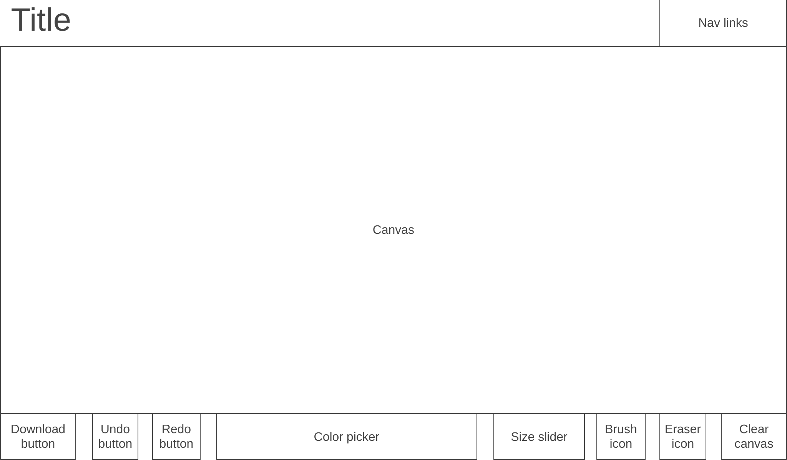

# Canvas

[Canvas](https://claudiaaziz.github.io/canvas/) is a drawing app that provides a digital canvas for creating art. It includes tools such as an extensive color palette for both the brush and background, an eraser, size ranges for the brush and eraser, as well as convenient undo, redo, and clear buttons.

## Functionality & MVPs

### In Canvas, users are able to:
- **Draw Freely:** Utilize a brush tool for freehand drawing.
- **Color Selection:** Pick and change colors seamlessly with a color picker.
- **Tool Variety:** Choose between brush, eraser, and background (paint bucket) tools.
- **Size Control:** Adjust the size of the brush and eraser using a slider.
- **Undo and Redo:** Easily undo and redo actions for precise editing.

## Additional Features
- **Download Image:** Save your canvas with a download button.
- **Responsive Design:** Ensure a user-friendly experience on various devices.

## Wireframe:

- **Nav Bar:** Displays "Canvas" in HTML headings and links to this project's GitHub repo and my LinkedIn.
- **Canvas Section:** Takes up the majority of the screen for drawing.
- **Bottom Section:** Contains color picker, tool icons, size slider, and undo/ redo/ clear/ download buttons.

## Technologies, Libraries, APIs
Canvas leverages the following technologies:
- The Canvas API to render the canvas and enable the drawing functionality.
- Pickr Library for color picker functionality.
- Webpack to bundle and transpile the source JavaScript code.
- npm to manage project dependencies.

## Implementation Timeline
- **Friday Afternoon & Weekend:**
  - Setup project, including getting webpack up and running.
  - Create canvas, brush, color classes.
  - Get canvas to show up on the screen.
  - Research and implement drawing functionality.
  - Add color picker 
  - Implement undo and redo features.
  - Research and implement canvas clearing.
  - Add redo feature.
  - Research and implement different brush sizes.

- **Monday:**
  - Research and implement eraser functionality.
  - Create brush and eraser buttons.
  - Link slider to both brush and eraser.
  - Add download image button.

- **Tuesday**
  - Refine UI appearance.
  - Add canvas title.
  - Add icons for undo, redo, clear, and download.
  - Add navigation links.

- **Wednesday**
  - Research how to change the slider line color dynamically with the current color.
  - Research CSS animations to have brush icons floating around in the background at the top.
  - Explore alternative brush designs and develop custom brush effects, such as glitter, gradients, patterns, and textures.
  - Implement Custom Backgrounds feature: Allow users to set a custom background or choose from a variety of backgrounds to draw on.
  - Create a gallery feature for users to showcase and share their art.
  - Add media queries for improved responsiveness.
  - Enable the ability to add text or import images onto the canvas.
  - Implement Opacity Control for the colors.
  - Introduce a dotted brush option.

- **Thursday Morning:**
  - Rewrite this proposal as a production README.
