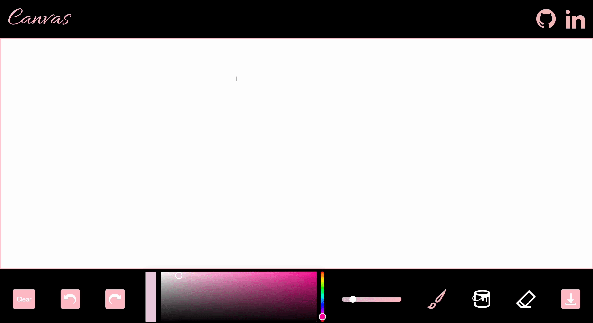
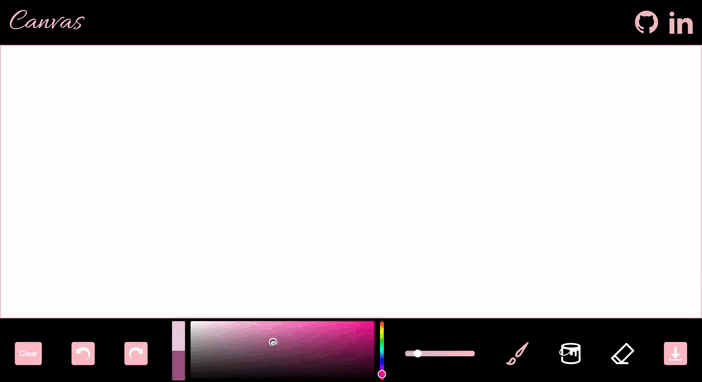

# Canvas

[Canvas](https://claudiaaziz.github.io/canvas/) is a drawing app that provides a digital canvas for creating art. It includes tools such as an extensive color palette for both the brush and background, an eraser, size ranges for the brush and eraser, as well as convenient undo, redo, and clear buttons.



## Functionality & MVPs

### In Canvas, users are able to:
- **Draw Freely:** Utilize a brush tool for freehand drawing.
- **Color Selection:** Pick and change colors seamlessly with a color picker.


- **Tool Variety:** Choose between brush, eraser, and background (paint bucket) tools.
- **Size Control:** Adjust the size of the brush and eraser using a slider.
- **Undo and Redo:** Easily undo and redo actions for precise editing.
- **Download Image:** Save their canvas with a download button.

## Technologies, Libraries, APIs
Canvas leverages the following technologies:
- The Canvas API to render the canvas and enable the drawing functionality.
- Pickr Library for color picker functionality.
- Webpack to bundle and transpile the source JavaScript code.
- npm to manage project dependencies.

## Implementation Details

The Canvas app is built with a modular and organized structure, making it easy to understand and extend. Here are some key components of the implementation:

### Changing Background Color and Eraser Paths

To change the background color in the Canvas app, the `bgColorChange` method is used. This method also ensures that the paths drawn with the eraser tool have their color updated accordingly.

```javascript
bgColorChange() {
  const drawnPaths = this.canvasHandler.RedoAndUndoHandler.drawnPaths;
  const redoStack = this.canvasHandler.RedoAndUndoHandler.redoStack;

  this.canvasHandler.eraseAndClearHandler.clear();
  this.canvasHandler.RedoAndUndoHandler.drawnPaths = drawnPaths;
  this.canvasHandler.RedoAndUndoHandler.redoStack = redoStack;
  drawnPaths.forEach((path) =>
    this.canvasHandler.RedoAndUndoHandler.redrawPath(path)
  );
  this.canvasHandler.canvas.style.backgroundColor = this.bgColor;
}
```

### Eraser Functionality

In Canvas, the eraser tool is implemented using the `isErase` attribute in the paths. When paths are redrawn, the `redrawPath` method checks this attribute to determine whether a point should be treated as an eraser point. Here's how it works:

```javascript
redrawPath(path) {
  path.forEach((point, idx) => {
    if (idx === 0) {
      this.canvasHandler.ctx.beginPath();
      this.canvasHandler.ctx.moveTo(point.x, point.y);
    } else {
      this.canvasHandler.ctx.lineTo(point.x, point.y);

      if (path.isErase) {
        point.color = this.canvasHandler.colorHandler.bgColor;
      }

      this.canvasHandler.brushHandler.setBrushStyling(
        point.color,
        point.brushSize
      );

      this.canvasHandler.ctx.stroke();
    }
  });
}
```

