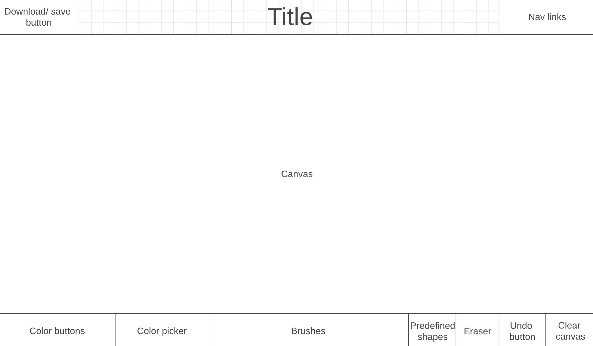

# Canvas
Canvas is a drawing app that allows users to create digital art through a variety of features, including an expansive color palette, brush types/ sizes/ patterns, and more!

## In Canvas, users will be able to:
- Choose from a palette of colors via a color picker or color buttons.
- Utilize different brush types or patterns, such as a small brush, larger brush, dotted brush, or a glitter effect.
- Undo their actions after releasing the mouse.
- Utilize simple shapes.
- Clear the canvas.

## In addition, this project will include:
- A production README

## Wireframe:

- Nav Bar
  - Displays "Canvas"
  - Links to GitHub repo for this project & my LinkedIn
- Canvas takes up the majority of the screen
- Bottom Section Contains:
  - Color Picker (for brush & background color)
  - Icons for brush (selected by default), eraser, background color
  - Size slider for brush & eraser
  - Undo, redo and clear button
  - Predefined Shape Selector

## Technologies, Libraries, APIs
- The Canvas API to render the canvas.
- Webpack to bundle and transpile the source JavaScript code.
- npm to manage project dependencies.

## Implementation Timeline
- **Friday Afternoon & Weekend:**
  - Setup project, including getting webpack up and running.
  - Get canvas to show up on the screen.
  - Research Canvas, how to make a circle appear, and implement drawing functionality when the user clicks on the page.
  - Research how to utilize the color picker.
  - Add a tbd amount of predefined color buttons.
  - Research how to create different brush types (small, large), dotted brush.
  - Research how to undo users' actions after the release of the mouse.
  - Research how to clear the canvas.

- **Monday:**
  - Research how to create predefined simple shapes (circle, square, star) and implement them in a select tag.

- **Tuesday & Wednesday:**
  - If everything above is done, work on adding bonus ideas.
  - Research other brush designs and implement custom brush effects (like glitter effect).
  - Improve CSS.
  - Custom Backgrounds: Allow users to set a custom background or choose from a variety of backgrounds to paint on.
  - Create a feature to save drawings/create a gallery. Users can share their art or download it.
  - Add media queries.
  - Add the ability to add text or import images onto the canvas.

- **Thursday Morning:**
  - Deploy to GitHub pages.
  - Bonus: Rewrite this proposal as a production README.
  - Bonus: Improve CSS.
